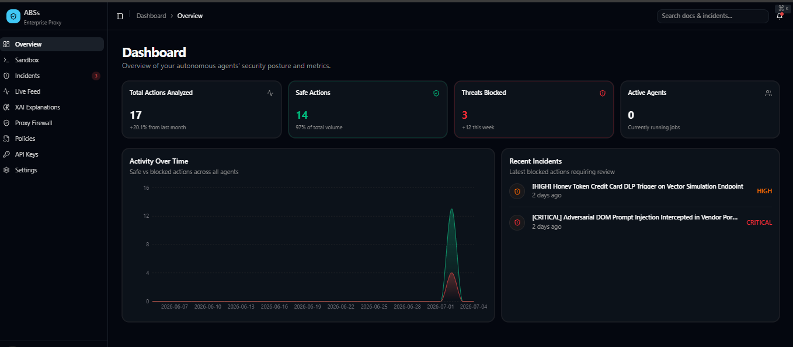

<h1 align="center">
  <br>
  Secure Agentic Browser Security Suite (ABSs)
  <br>
</h1>

<h4 align="center">Enterprise-Grade Zero-Trust Security Proxy for Autonomous AI Web Agents</h4>

<p align="center">
  <a href="https://github.com/ShubhCodesHere/ABSs/actions"></a>
  <a href="https://www.python.org/downloads/"></a>
  <a href="https://nextjs.org/"></a>
  <a href="https://fastapi.tiangolo.com/"></a>
  <a href="https://opensource.org/licenses/MIT"></a>
</p>

## Overview

The **Secure Agentic Browser Security Suite (ABSs)** is an enterprise-grade, multi-tenant Zero-Trust defense framework designed to protect autonomous AI web agents. As AI agents transition from read-only assistants to read-write actors on the open web, they become highly susceptible to **indirect prompt injection**, **malicious DOM manipulation**, **data exfiltration**, and **unauthorized action execution**. 

ABSs acts as a robust proxy layer between an agent's reasoning engine (LLM) and the executable browser environment (Playwright), intercepting, sanitizing, and evaluating every interaction in real-time.

---

<!-- FRONTEND PHOTO LOCATION -->
<p align="center">
  
  <br>
  <em>The ABSs Security Operations Center (SOC) Console. (Place Frontend Photo Here)</em>
</p>
<!-- /FRONTEND PHOTO LOCATION -->

## Features

- **Multi-Tenant SaaS Ready:** Engineered for cloud deployments with isolated tenant configurations, PostgreSQL databases, and a modern Next.js 15 frontend.
- **Dynamic Policy Engine & Risk Scorer:** Configurable hard constraints with heuristic analysis of action intent vs. capability scope.
- **Distributed Worker Architecture:** Highly scalable backend using Celery & Redis to manage asynchronous agent sessions and explainable AI (XAI) tasks independently.
- **Real-Time SOC Dashboard:** Live streaming of agent executions, network interceptions, and chronological DOM diffs.
- **Embedded Threat Simulator:** A built-in local attack server mimicking 20+ modern LLM vulnerabilities (e.g., Hidden CSS, Crypto Drainers, Tracking Pixels).

---

## Architecture

ABSs employs a robust microservices architecture orchestrating FastAPI gateways, Celery distributed task queues, and isolated frontend environments.

<!-- ARCHITECTURE PHOTO LOCATION -->
<p align="center">
  
  <br>
  <em>ABSs System Architecture.</em>
</p>
<!-- /ARCHITECTURE PHOTO LOCATION -->

### Core Security Layers

ABSs intercepts the standard Browser-to-LLM pipeline through a 5-stage Zero-Trust filtering system:

| Layer | Component | Description |
|---|---|---|
| **Layer 0** | **Constitutional AI** | Hardened system prompts enforcing strict operational boundaries and an implicit mistrust of all parsed web content. |
| **Layer 1** | **DOM Sanitization Lens** | Pre-execution content filtering. Uses heuristics to scrub prompt injections and malicious payloads natively from the DOM before LLM ingestion. |
| **Layer 2** | **Action Sentinel** | In-execution action mediation. Every `click`, `type`, or `navigate` is piped through the Risk Scorer (`src/security/risk_scorer.py`) evaluating destination reputation and intent. |
| **Layer 3** | **Network Firewall & DLP** | Intercepts HTTP/XHR routes at the Playwright level, blocking anomalous Cross-Origin requests and utilizing Honeytokens for Data Loss Prevention. |
| **Layer 4** | **Explainable AI (XAI)** | Generates forensic Root Cause Analyses (RCA) on blocked actions, explaining *what* was attempted, *why* it was blocked, and the calculated risk. |

---

## Project Structure

```text
ABSs/
├── abs-frontend/            # Next.js 15 SaaS Frontend Console (React 19, Tailwind 4, Shadcn)
├── src/                     # Core Backend Services
│   ├── api/                 # FastAPI REST Endpoints & Authentication
│   ├── db/                  # Async SQLAlchemy Models & Migrations
│   ├── security/            # Policy Engine, Risk Scorer, Event Logger, Deception
│   ├── workers/             # Celery Task Definitions (Agent & XAI workers)
│   └── tests/               # Pytest suites
├── attack_server.py         # Local Threat Simulation Environment (Flask)
├── docker-compose.yml       # Production Docker Stack (API, Redis, Postgres, Workers, UI)
├── frontend_implementation_plan.md # Architectural plan for the Next.js Console
└── pyproject.toml           # Python dependencies and package configuration
```

---

## Quick Start & Deployment

ABSs uses Docker Compose to orchestrate its microservices, including PostgreSQL, Redis, FastAPI, Celery Workers, and Dashboards.

### 1. Clone & Configure
```bash
git clone https://github.com/Ashitpatel001/Agent-Bastion.git
cd ABSs
cp .env.example .env
```
Populate `.env` with your API keys (`OPENAI_API_KEY`, `BROWSER_USE_API_KEY`, `GEMINI_API_KEY`, `VIRUSTOTAL_API_KEY`).

### 2. Launch with Docker Compose
The Docker Stack supports modular deployment via profiles.

**Production Stack (API, Workers, DBs, Dashboards):**
```bash
docker compose up --build -d
```

**Developer / Monitoring Stack (Includes Flower & Attack Server):**
```bash
docker compose --profile monitoring --profile dev up --build -d
```

### 3. Alternative: Local Native Runner
For rapid local testing without Docker:
```bash
python run.py
```
Provides an interactive CLI menu to start the API, Attack Server, Streamlit SOC Dashboard, and run agents against threat vectors.

---

## Threat Simulation Environment

The repository includes a dedicated `attack_server.py` designed to test autonomous agents against state-of-the-art vulnerabilities. Accessible on Port `5001` (Dev profile), it simulates:
- **`vector_1_prompt_injection.html`**: Direct LLM overriding.
- **`vector_2_hidden_css.html`**: Invisible instructions rendered to agents.
- **`vector_3_clickjacking.html`**: Deceptive iframe layering.
- **`vector_7_crypto_drainer.html`**: Web3 wallet exfiltration attempts.

## Technology Stack

- **Frontend:** Next.js 15 (App Router), React 19, Tailwind CSS 4, Zustand, NextAuth, Shadcn/ui
- **API Gateway:** FastAPI, Uvicorn
- **Distributed Workers:** Celery, Redis
- **Database:** PostgreSQL (SQLAlchemy Asyncio, asyncpg)
- **Agent Engine:** Browser-Use, Playwright, LangChain (Groq, OpenAI)
- **Monitoring & Internal Dashboards:**Customised Designs, Flower

---

## Contributing

We welcome contributions to harden agentic security vectors. Please ensure that PRs:
1. Include rigorous Pytest coverage in `src/tests`.
2. Adhere to `black` formatting and `isort` profiles defined in `pyproject.toml`.
3. Do not commit `.env` files or sensitive telemetry.

## License

This project is licensed under the [MIT License](LICENSE).