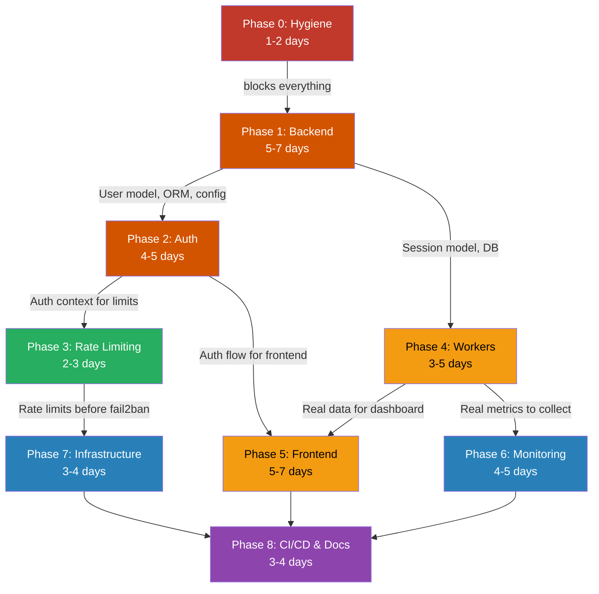

# Agent-Bastion: Production Roadmap

> Principal Architect Review — based on full audit of every source file + `implementation.md`

---

## 1. Executive Architectural Assessment

Agent-Bastion has a **strong core idea and a functional security engine**, but the project is in a prototype state being marketed as production-ready. The gap between what the README/plan claims and what actually exists is significant.

**What works:** The 5-layer `SecureAgent` pipeline (URL validation, input sanitization, action policies, content security, audit logging) is well-architected, testable, and forms a genuine differentiator. The 20-vector attack simulator is unique in this space. The frontend is visually polished.

**What doesn't work:** The system has **zero authentication**, uses **SQLite in a multi-worker Docker environment** (which will corrupt under concurrent writes), stores all tenant state **in-memory** (lost on every restart), runs Docker containers **as root**, has **real API keys committed to git history**, and the frontend dashboard displays **100% hardcoded mock data** with zero API integration.

The `implementation.md` plan proposes adding Caddy, WAF, fail2ban, Prometheus, and Grafana — but this is the wrong priority order. You don't add armor plating to a building with no walls. **Authentication, database stability, and data persistence must come first.**

**Verdict:** The security engine is the gem. Everything around it — the API layer, database, auth, frontend integration, infrastructure — needs to be rebuilt or significantly hardened before this is shippable.

**Estimated total effort:** 30–42 developer-days (6–9 weeks solo, 3–5 weeks with 2 developers).

---

## 2. Architectural Flaws

### Flaw 1: SQLite in a Multi-Process Containerized System — CRITICAL

[database.py](file:///D:/ABSs/src/db/database.py) uses raw `sqlite3` to write to `abs_security.db`. The system also runs multiple uvicorn workers + Celery workers, all targeting the same file. SQLite does not support concurrent writes — this **will** produce `database is locked` errors under any real load. PostgreSQL is defined in `docker-compose.yml` but nothing connects to it.

**Fix:** Migrate to PostgreSQL via SQLAlchemy async + `asyncpg`. The Postgres container already exists — wire it up.

### Flaw 2: Zero Authentication on the Entire API — CRITICAL

Every endpoint in [routes.py](file:///D:/ABSs/src/api/routes.py) — including `POST /api/v1/tenants`, `PUT /api/v1/tenants/{id}/policy`, `GET /api/v1/security/events` — is completely unauthenticated. Anyone on the network can create tenants, modify security policies, and read all security events. This makes the product **unusable in any real environment**.

**Fix:** JWT-based auth with API key support. RBAC with admin/operator/viewer roles. FastAPI `Depends()` on every route.

### Flaw 3: CORS Allows All Origins — HIGH

[run.py](file:///D:/ABSs/run.py) sets `allow_origins=["*"]`. Any website on the internet can make cross-origin requests to the API. For a security product, this is particularly embarrassing.

**Fix:** Configurable allowlist via `CORS_ORIGINS` env var. Default to `["http://localhost:3000"]` only.

### Flaw 4: In-Memory Tenant State — HIGH

[tenant_policy.py](file:///D:/ABSs/src/security/tenant_policy.py) stores all tenant policies in a Python `dict`. Every process restart, every deploy, every crash wipes all tenant configuration. The `_rate_limit_tracker` dict also leaks memory — old entries are never cleaned up.

**Fix:** Persist to PostgreSQL. Load into memory as a cache with TTL-based invalidation.

### Flaw 5: No Database Migrations — HIGH

The schema is defined as raw `CREATE TABLE` SQL strings. There is no Alembic, no migration history, no way to evolve the schema without manual intervention or data loss.

**Fix:** Alembic with auto-generation from SQLAlchemy models. Version-controlled migration history.

### Flaw 6: Docker Runs as Root — MEDIUM

The [Dockerfile](file:///D:/ABSs/Dockerfile) has no `USER` directive. Any RCE vulnerability gives an attacker root privileges inside the container.

**Fix:** Multi-stage build, non-root user (`adduser appuser && USER appuser`), pinned base image.

---

## 3. Components to Preserve (Keep As-Is)

These are well-built and should not be modified except for minor integration changes:

| Component | Location | Why Preserve |
|---|---|---|
| `SecureAgent` orchestrator | [secure_agent.py](file:///D:/ABSs/src/security/secure_agent.py) | Clean pipeline pattern. Aggregates risk scores correctly. Each layer is independent and testable. |
| `URLSecurityLayer` | [secure_agent.py](file:///D:/ABSs/src/security/secure_agent.py) | Levenshtein-based typosquatting detection is a smart, defensible approach. Blocklist + heuristic combination is solid. |
| `InputSanitizationLayer` | [secure_agent.py](file:///D:/ABSs/src/security/secure_agent.py) | Regex-based detection of prompt injection, XSS, SQLi, path traversal, command injection. Covers the major vectors. |
| `ContentSecurityLayer` | [secure_agent.py](file:///D:/ABSs/src/security/secure_agent.py) | Detects hidden iframes, crypto miners, tracking pixels, clickjacking, phishing forms. Thorough. |
| `ActionPolicyLayer` | [secure_agent.py](file:///D:/ABSs/src/security/secure_agent.py) | Declarative policy enforcement from `policies.json`. Easy to extend. |
| `policies.json` | [policies.json](file:///D:/ABSs/policies.json) | Clean declarative format. Easy for users to understand and customize. |
| Attack vector simulator | [generate_tests.py](file:///D:/ABSs/generate_tests.py) + `vector_*.html` | Unique differentiator. 20 vectors. Great for demos and regression testing. |
| Unit test suite | [test_security.py](file:///D:/ABSs/src/tests/test_security.py) | 24 tests with good coverage of security layer logic. Expand, don't replace. |
| Frontend visual design | [page.tsx](file:///D:/ABSs/abs-frontend/src/app/page.tsx) | Professional dark-theme dashboard. Keep the design; wire it to real data. |
| `Makefile` | [Makefile](file:///D:/ABSs/Makefile) | Clean dev workflow targets. Keep and extend. |

---

## 4. Components to Refactor (Modify In-Place)

| Component | Location | What to Change | Why |
|---|---|---|---|
| `AuditLogger` | [secure_agent.py](file:///D:/ABSs/src/security/secure_agent.py) | Replace direct SQLite writes with SQLAlchemy async ORM calls. | Currently tightly coupled to SQLite. Same class, different backend. |
| `TenantPolicyEngine` | [tenant_policy.py](file:///D:/ABSs/src/security/tenant_policy.py) | Add PostgreSQL persistence behind the in-memory dict. Dict becomes a write-through cache with TTL invalidation. Fix the `_rate_limit_tracker` memory leak. | In-memory state is lost on restart. Rate limit tracker leaks. |
| `XAIAnalyzer` | [xai_analyzer.py](file:///D:/ABSs/src/security/xai_analyzer.py) | Add retry logic (3 attempts, exponential backoff), configurable timeout, structured error logging, model name from config. | Currently swallows all errors silently, hardcodes model, no retries. |
| API route handlers | [routes.py](file:///D:/ABSs/src/api/routes.py) | Add auth dependencies, pagination, input validation, structured error responses. Keep endpoint structure. | Logic is fine; missing auth and validation. |
| Pydantic schemas | [schemas.py](file:///D:/ABSs/src/api/schemas.py) | Add field constraints (max lengths, regex patterns, enums). Restrict `metadata` dict to known keys. | Currently accepts anything — potential injection vector. |
| `run.py` entry point | [run.py](file:///D:/ABSs/run.py) | Extract app creation to `app.py`. Fix CORS. Add Pydantic `Settings` class. Add proper startup/shutdown lifecycle. | Mixes app creation with server startup. CORS is `*`. |
| `docker-compose.yml` | [docker-compose.yml](file:///D:/ABSs/docker-compose.yml) | Add health checks on all services, resource limits, env var references for secrets, remove `version` key. Wire FastAPI to Postgres. | Currently partial — Postgres exists but isn't used. No health checks. |
| `.dockerignore` | [.dockerignore](file:///D:/ABSs/.dockerignore) | Ensure `.env`, `*.db`, `venv/`, `__pycache__/`, `.git/` are excluded. | Prevents secrets from leaking into Docker images. |

---

## 5. Components to Replace (Delete and Rebuild)

| Component | Location | Replacement | Why |
|---|---|---|---|
| `SecurityEventDB` (raw SQLite) | [database.py](file:///D:/ABSs/src/db/database.py) | SQLAlchemy async models + Alembic migrations targeting PostgreSQL | Raw SQLite with string-formatted queries. No ORM, no migrations, no connection pooling. Unredeemable for production. |
| `Dockerfile` | [Dockerfile](file:///D:/ABSs/Dockerfile) | Multi-stage build, non-root user, pinned base image, proper layer caching | Current Dockerfile runs as root, copies everything, no multi-stage, unpinned base. |
| Celery task stubs | [agent_tasks.py](file:///D:/ABSs/src/workers/agent_tasks.py) | Real task implementations with Playwright browser automation, result backend, retry policies, timeout handling | `run_agent_session` literally does `time.sleep()` and returns mock data. Hardcoded broker URL. |
| Custom `LokiHandler` (from `implementation.md`) | Proposed in plan | Promtail sidecar container | The proposed handler does synchronous HTTP POST inside a Python logging handler, blocking the async event loop. Promtail is the Grafana-recommended, battle-tested solution. |

---

## 6. Components to Remove (Delete Entirely)

| Component | Location | Why Remove |
|---|---|---|
| `start_saas.py` | [start_saas.py](file:///D:/ABSs/start_saas.py) | Shells out to `npm` from Python, hardcodes sample data, duplicates `run.py`. Fragile and unnecessary. |
| `init_db.py` | [init_db.py](file:///D:/ABSs/init_db.py) | Manual DB init with hardcoded sample data. Replaced entirely by Alembic migrations + seed scripts. |
| `test_agent.py` (root) | [test_agent.py](file:///D:/ABSs/test_agent.py) | Minimal test file superseded by `src/tests/test_security.py`. |
| `abs_security.db` | Root directory | Committed database file. Contains data that shouldn't be in version control. |
| `.env` (committed) | [.env](file:///D:/ABSs/.env) | Contains real API keys. Must be purged from git history. |
| WAF prompt-injection rules | From `implementation.md` plan | Rules like `@contains "ignore previous instructions"` are trivially bypassable (Unicode, rephrasing, encoding). Prompt injection is an app-layer concern handled by `InputSanitizationLayer`. WAF should handle HTTP-layer attacks only. Creates false sense of security. |
| DNS round-robin "CDN" | From `implementation.md` plan | DNS round-robin is not a CDN. No content-aware routing, no failover, no cache invalidation. Adds operational complexity for negligible benefit at this stage. Defer until multi-region demand exists. |

**Relocate (don't delete):**

| Component | From | To | Why |
|---|---|---|---|
| `main_secure.py` | Root | `examples/demo_standalone.py` | Useful demo script, but clutters root. |
| `main_template.py` | Root | `examples/template.py` | Useful template, but clutters root. |
| `vector_*.html` files | Root | `tests/fixtures/vectors/` | Generated test artifacts polluting project root. |

---

## 7. Missing Production Components

| # | Component | Why Needed | Priority |
|---|---|---|---|
| 1 | **Authentication (JWT + API keys)** | Without it, every endpoint is open to the internet. The product is literally unusable. | **P0 — Ship blocker** |
| 2 | **Authorization (RBAC)** | Multi-tenant isolation requires role-based access. Without it, any tenant can read/modify any other tenant's data. | **P0 — Ship blocker** |
| 3 | **PostgreSQL integration** | SQLite cannot support multi-worker concurrent writes. The system will corrupt under load. | **P0 — Ship blocker** |
| 4 | **Database migrations (Alembic)** | Cannot evolve schema without data loss. Manual `CREATE TABLE` is not maintainable. | **P0 — Ship blocker** |
| 5 | **Configuration management** | Mix of hardcoded values, env vars, and `.env` files with no validation. App should fail-fast on missing config. | **P1** |
| 6 | **Structured error responses** | No consistent error format. Some endpoints return raw Python exceptions. | **P1** |
| 7 | **Input validation constraints** | Pydantic models have no field limits (max lengths, formats). Accepts arbitrary data. | **P1** |
| 8 | **Frontend ↔ API integration** | Dashboard is 100% mock data. Zero API calls. | **P1** |
| 9 | **Rate limiting middleware** | No request throttling. Vulnerable to abuse and resource exhaustion. | **P1** |
| 10 | **CI/CD pipeline** | No automated tests on PR. No lint checks. No quality gates. | **P1** |
| 11 | **Monitoring (Prometheus + Grafana)** | No visibility into system health, request patterns, or security events in real-time. | **P2** |
| 12 | **Reverse proxy + WAF (Caddy + Coraza)** | Direct exposure of FastAPI/Next.js to the internet. No security headers, no TLS termination. | **P2** |
| 13 | **DDoS protection (fail2ban)** | No brute-force protection at the network layer. | **P2** |
| 14 | **Backup strategy** | No PostgreSQL volume backup configuration. | **P2** |

---

## 8. Optimal Implementation Order

The `implementation.md` plan proposes starting with infrastructure (Caddy, WAF, fail2ban, monitoring). **This is the wrong order.** Here's why:

```
implementation.md order:        This roadmap's order:
─────────────────────────       ──────────────────────
1. Caddy + WAF                  1. Purge secrets, clean repo
2. fail2ban                     2. PostgreSQL + migrations + config
3. Redis rate limiting          3. Authentication + RBAC
4. Prometheus + Grafana         4. Rate limiting (small, adjacent to auth)
5. Loki logging                 5. Celery workers (real, not stubs)
6. (auth never mentioned)       6. Frontend integration (needs real data)
7. (DB migration never          7. Monitoring stack
    mentioned)                  8. Infrastructure (Caddy, WAF, fail2ban)
                                9. CI/CD + documentation
```

**Rationale:**
- You don't add a vault door to a house with no walls (no auth → WAF is pointless)
- You don't add monitoring to a system producing no real data (stubs → no metrics)
- You don't build a dashboard that displays fake numbers (mock data → meaningless UI)
- You fix the database before anything else (SQLite corruption → data loss)

---

## 9. Phase-by-Phase Roadmap

---

### Phase 0: Security Hygiene & Repo Cleanup

**Duration:** 1–2 days · **Difficulty:** 🟢 Easy

**Scope:** Eliminate committed secrets, clean project structure, establish a safe baseline.

**Tasks:**

| # | Task | Details |
|---|---|---|
| 0.1 | Purge `.env` from git history | Use `BFG Repo-Cleaner` or `git filter-repo`. **Rotate all exposed API keys immediately** (GROQ, OpenAI, Gemini). |
| 0.2 | Remove `abs_security.db` from repo | Delete file, add `*.db` to `.gitignore`. |
| 0.3 | Delete dead files | `start_saas.py`, root `test_agent.py`, `init_db.py`. |
| 0.4 | Relocate demo files | `main_secure.py` → `examples/`, `main_template.py` → `examples/`. |
| 0.5 | Relocate test vectors | All `vector_*.html` → `tests/fixtures/vectors/`. Update paths in `generate_tests.py`. |
| 0.6 | Fix `.env.example` | Remove default `SECRET_KEY`. Add comments explaining each variable. No real values. |
| 0.7 | Fix `.dockerignore` | Ensure `.env`, `*.db`, `venv/`, `__pycache__/`, `.git/`, `node_modules/` are excluded. |

---

### Phase 1: Core Backend Stabilization

**Duration:** 5–7 days · **Difficulty:** 🟡 Medium

**Scope:** PostgreSQL migration, SQLAlchemy ORM, Alembic migrations, configuration management, error handling, Dockerfile hardening.

**Tasks:**

| # | Task | Details |
|---|---|---|
| 1.1 | Define SQLAlchemy async models | Tables: `security_events`, `tenants`, `tenant_policies`, `sessions`. Prepare `users` table schema for Phase 2. |
| 1.2 | Set up Alembic | Initialize with async PostgreSQL driver. Auto-generate initial migration from models. |
| 1.3 | Replace `SecurityEventDB` | Swap raw SQLite calls for SQLAlchemy async queries. All CRUD through the ORM. |
| 1.4 | Persist `TenantPolicyEngine` | PostgreSQL-backed storage. In-memory dict becomes a write-through cache with TTL invalidation. Fix `_rate_limit_tracker` memory leak. |
| 1.5 | Pydantic `Settings` class | Single settings class reading all config from environment. Validate at startup. Fail-fast on missing required values. |
| 1.6 | Fix CORS | Configurable allowlist via `CORS_ORIGINS` env var. Default: `["http://localhost:3000"]`. |
| 1.7 | Structured error responses | Global exception handlers. Consistent format: `{"error": {"code": "...", "message": "...", "details": {}}}`. |
| 1.8 | Input validation | Add constraints to all Pydantic schemas: max lengths, regex patterns, enums, URL format validation. Restrict `ActionRequest.metadata` to known keys. |
| 1.9 | Health check upgrade | `/health` checks: DB connection, Redis ping, Celery worker heartbeat. Returns component status. |
| 1.10 | Dockerfile hardening | Multi-stage build (builder + runtime). Non-root `appuser`. Pinned `python:3.12.x-slim-bookworm`. Proper layer caching. |
| 1.11 | Wire `docker-compose.yml` | FastAPI → PostgreSQL. Health checks on all services. Env var references for all secrets. Resource limits. Remove deprecated `version` key. |

---

### Phase 2: Authentication & Authorization

**Duration:** 4–5 days · **Difficulty:** 🟠 Medium-High

**Scope:** JWT auth, API key issuance, RBAC, tenant isolation.

**Tasks:**

| # | Task | Details |
|---|---|---|
| 2.1 | `User` model + migration | Columns: id, email, hashed_password, role (`admin` / `operator` / `viewer`), tenant_id, created_at, is_active. |
| 2.2 | Password hashing | `bcrypt` via `passlib`, cost factor ≥ 12. |
| 2.3 | JWT token endpoints | `POST /api/v1/auth/register` (admin-only invite), `POST /api/v1/auth/token` (login), `POST /api/v1/auth/refresh`. Configurable TTL (default 30 min). Single-use refresh tokens. |
| 2.4 | API key system | Per-tenant API keys for programmatic access. Keys stored hashed (SHA-256). Transmitted via `X-API-Key` header. CRUD endpoints for key management. |
| 2.5 | Auth dependency | `Depends(get_current_user)` on every route except `/health`, `/docs`, `/openapi.json`. |
| 2.6 | RBAC enforcement | Admin: full access. Operator: CRUD on own tenant only. Viewer: read-only on own tenant. |
| 2.7 | Tenant isolation | All database queries filter by `tenant_id` from the authenticated user's context. No cross-tenant data leakage. |
| 2.8 | First-run bootstrap | On first startup with empty DB, create a default admin user with a generated password printed to logs. |

---

### Phase 3: Rate Limiting

**Duration:** 2–3 days · **Difficulty:** 🟢 Easy-Medium

**Scope:** Redis-based sliding window rate limiting. The algorithm from `implementation.md` is correct — implement it as specified.

**Tasks:**

| # | Task | Details |
|---|---|---|
| 3.1 | Redis rate limiter middleware | Sliding window counter using sorted sets (the `implementation.md` design is good). |
| 3.2 | Per-endpoint limits | Auth: 10/min. Session create: 5/min. Tenant create: 2/hr. Default: 200/min. |
| 3.3 | Per-tenant limits | Apply tenant-specific rate limits from `TenantPolicy.rate_limits`. Use the more restrictive of IP vs tenant limit. |
| 3.4 | Response headers | `X-RateLimit-Limit`, `X-RateLimit-Remaining`, `X-RateLimit-Reset`, `Retry-After` on 429. |
| 3.5 | Redis connection pool | Shared async pool (max 20 connections). Reuse across rate limiter, Celery, cache. |

---

### Phase 4: Celery Workers & Agent Execution

**Duration:** 3–5 days · **Difficulty:** 🟡 Medium

**Scope:** Replace stub tasks with real browser automation. Session lifecycle management.

**Tasks:**

| # | Task | Details |
|---|---|---|
| 4.1 | Implement `run_agent_session` | Real Playwright browser automation. Session lifecycle: create → navigate → validate actions → complete/fail. |
| 4.2 | Task result backend | Store results in Redis (short-term) and PostgreSQL (permanent). |
| 4.3 | Retry & error handling | 3 retries with exponential backoff. Dead-letter queue for permanent failures. Structured error capture. |
| 4.4 | Session status tracking | Status updates via Redis pub/sub → SSE endpoint for frontend. States: `queued` → `running` → `completed` / `failed` / `timed_out`. |
| 4.5 | Resource limits | Per-session timeout (configurable, default 5 min). Docker `shm_size` for Chromium. Memory limits. |
| 4.6 | XAI analyzer hardening | 3 retries, 10-second timeout, structured fallback response, proper error logging (not bare `except: pass`). Model name from config. |
| 4.7 | Scaling documentation | Document model: 1 browser per worker, scale via `docker compose up --scale celery-agent=N`. |

---

### Phase 5: Frontend Integration

**Duration:** 5–7 days · **Difficulty:** 🟡 Medium

**Scope:** Replace all mock data with real API calls. Add auth flow. Add missing pages.

**Tasks:**

| # | Task | Details |
|---|---|---|
| 5.1 | API client layer | Typed fetch wrapper with automatic JWT refresh, error handling, request/response interceptors. |
| 5.2 | Auth pages | Login page. Session management (logout). API key management page. |
| 5.3 | Dashboard integration | Replace hardcoded mock data in `page.tsx` with calls to `/api/v1/security/stats`, `/api/v1/security/events`. |
| 5.4 | Sessions page | List sessions, view detail, terminate. Real-time status via SSE. |
| 5.5 | Security events page | Paginated event log with filters: date range, risk level, event type, tenant. |
| 5.6 | Tenant policy page | View and edit policies for current tenant. JSON editor for `custom_rules`. |
| 5.7 | Simulation page | Run attack simulations from UI. Display results with risk visualization. |
| 5.8 | Real-time event feed | SSE (Server-Sent Events) for live security events on dashboard. Simpler and sufficient vs WebSocket for one-directional updates. |
| 5.9 | UX polish | Skeleton loaders, error boundaries, toast notifications, empty states. |

---

### Phase 6: Monitoring & Observability

**Duration:** 4–5 days · **Difficulty:** 🟡 Medium

**Scope:** Prometheus, Grafana dashboards, structured logging, Promtail + Loki.

**Tasks:**

| # | Task | Details |
|---|---|---|
| 6.1 | Prometheus middleware | Request count, latency histogram, error rate. **Normalize path labels** (`/api/v1/sessions/{id}` → `/api/v1/sessions/:id`) to prevent high-cardinality explosion. |
| 6.2 | Business metrics | `abs_active_sessions`, `abs_agent_actions_total{verdict}`, `abs_security_events_total{event_type}`, `abs_session_duration_seconds`, `abs_llm_request_duration_seconds`. |
| 6.3 | `/metrics` endpoint | **Internal-only** — not routed through Caddy. Only accessible on Docker internal network. |
| 6.4 | Prometheus config | `prometheus.yml` with scrape targets. Add `redis_exporter` sidecar (Redis doesn't expose Prometheus metrics natively — the `implementation.md` is wrong about scraping Redis directly). |
| 6.5 | Grafana provisioning | Auto-provision datasources (Prometheus + Loki) and dashboards on container startup. |
| 6.6 | Pre-built dashboard | Ship `grafana/dashboards/abs-overview.json`: active sessions, block rate %, security events/hr, HTTP errors, LLM latency P99, top blocked actions. |
| 6.7 | Structured logging | Replace all `print()` statements with Python `logging` module. JSON format. Correlation IDs (session_id, tenant_id) on every log line. |
| 6.8 | Log shipping via Promtail | Promtail sidecar reads log files, ships to Loki. **Do NOT use the custom `LokiHandler` from `implementation.md`** — it does synchronous HTTP POST inside a logging handler, blocking the async event loop. |

---

### Phase 7: Infrastructure Hardening

**Duration:** 3–4 days · **Difficulty:** 🟡 Medium

**Scope:** Caddy reverse proxy, Coraza WAF, fail2ban, security headers, network isolation.

**Tasks:**

| # | Task | Details |
|---|---|---|
| 7.1 | Caddy reverse proxy | Caddyfile with local dev mode (`:80`) and production mode (domain + auto-TLS). Route `/api/*` → FastAPI, `/*` → Next.js. |
| 7.2 | Coraza WAF | Caddy + Coraza plugin. OWASP CRS rules only. **No prompt-injection rules at WAF level** — those are trivially bypassable and belong in `InputSanitizationLayer`. WAF handles SQLi, XSS, path traversal, protocol violations. |
| 7.3 | Security headers | HSTS, X-Frame-Options DENY, X-Content-Type-Options nosniff, CSP, Referrer-Policy, Permissions-Policy, remove Server header. |
| 7.4 | fail2ban | Auth brute force (10 failures in 60s → 30-min ban). Scanner detection (20 404s in 60s → 24-hr ban). HTTP flood (300 req/min → 1-hr ban). |
| 7.5 | Network isolation | Only Caddy (80/443) and Grafana (3001) exposed on host. Postgres, Redis, Prometheus, Loki — internal Docker network only. Verify with `docker compose port` audit. |
| 7.6 | Compose file split | `docker-compose.yml` (core: FastAPI, Next.js, Postgres, Redis, Caddy). `docker-compose.monitoring.yml` (Prometheus, Grafana, Loki, Promtail). `docker-compose.security.yml` (fail2ban). Compose merge via `docker compose -f ... -f ... up`. |

---

### Phase 8: CI/CD, Testing & Documentation

**Duration:** 3–4 days · **Difficulty:** 🟢 Easy-Medium

**Scope:** Automated quality gates, comprehensive tests, production-ready documentation.

**Tasks:**

| # | Task | Details |
|---|---|---|
| 8.1 | GitHub Actions CI | On PR: lint (`ruff`), type-check (`mypy`), unit tests, integration tests (Postgres + Redis via service containers). |
| 8.2 | Integration tests | API endpoint tests with real database. Auth flow tests. Tenant isolation tests. Rate limiting tests. |
| 8.3 | Security scan | OWASP ZAP scan in CI against running Docker Compose stack. Zero high/critical findings gate. |
| 8.4 | Load test baseline | k6 script for key endpoints. Establish baseline: X req/sec at P99 < 200ms. |
| 8.5 | README rewrite | Accurate architecture diagram, real screenshots/GIF, one-command install, honest feature list. |
| 8.6 | API documentation | Customize FastAPI OpenAPI schema. Add examples, descriptions, error codes for every endpoint. |
| 8.7 | Deployment guide | Step-by-step: VPS setup, DNS configuration, Caddy SSL, environment variables, backup strategy. |
| 8.8 | `CONTRIBUTING.md` | Dev setup, code standards, PR process, test requirements. |

---

## 10. Deliverables Per Phase

| Phase | Key Deliverables |
|---|---|
| **0: Hygiene** | Clean git history. Reorganized project structure. Safe `.env.example`. Updated `.gitignore` and `.dockerignore`. |
| **1: Backend** | SQLAlchemy models. Alembic migrations. PostgreSQL integration. Pydantic Settings. Error handling middleware. Hardened Dockerfile. Updated `docker-compose.yml`. |
| **2: Auth** | User model + migration. JWT auth endpoints. API key system. RBAC middleware. Tenant isolation. First-run bootstrap. |
| **3: Rate Limit** | Redis rate limiter middleware. Per-endpoint and per-tenant limits. Connection pool. Response headers. |
| **4: Workers** | Real `run_agent_session` with Playwright. Task retry policies. Session status tracking. Hardened XAI analyzer. |
| **5: Frontend** | Auth pages. Integrated dashboard. Sessions/events/policies/simulation pages. SSE real-time feed. Loading/error states. |
| **6: Monitoring** | Prometheus middleware + config. Pre-built Grafana dashboard. Structured JSON logging. Promtail + Loki. Redis exporter. |
| **7: Infra** | Caddy + Coraza WAF. fail2ban config. Security headers. Network isolation. Split compose files. |
| **8: CI/CD** | GitHub Actions workflow. Integration + security tests. k6 load test. README, API docs, deployment guide. |

---

## 11. Acceptance Criteria

### Phase 0
- [ ] `git log --all -- .env` shows no secrets in history
- [ ] `abs_security.db` absent from repo and in `.gitignore`
- [ ] Project root contains only production files
- [ ] `docker build` produces image without `.env` or `*.db`

### Phase 1
- [ ] `alembic upgrade head` creates all tables in PostgreSQL
- [ ] All 24 existing tests pass against PostgreSQL
- [ ] `TenantPolicyEngine` data survives process restart
- [ ] App exits with clear error on missing `DATABASE_URL` or `REDIS_URL`
- [ ] CORS rejects requests from unlisted origins
- [ ] `/health` returns `{"status": "healthy", "db": "ok", "redis": "ok"}`
- [ ] Docker image runs as non-root, size < 200MB

### Phase 2
- [ ] Unauthenticated requests to any endpoint (except `/health`, `/docs`) return `401`
- [ ] JWT tokens expire after configured TTL (default 30 min)
- [ ] Refresh tokens are single-use and rotate
- [ ] API keys are stored hashed (not plaintext)
- [ ] Operator cannot access other tenants' data
- [ ] Viewer cannot modify any data

### Phase 3
- [ ] `429` returned when limit exceeded, with correct `Retry-After` header
- [ ] Rate limits enforced per-IP AND per-tenant (more restrictive wins)
- [ ] Rate state survives FastAPI restart (persisted in Redis)
- [ ] Rate limiting adds < 2ms latency per request

### Phase 4
- [ ] Agent session runs real browser automation end-to-end
- [ ] Failed tasks retry up to 3 times with exponential backoff
- [ ] Sessions exceeding timeout are terminated cleanly (no orphaned browsers)
- [ ] XAI analysis completes or returns structured fallback within 10 seconds

### Phase 5
- [ ] Login → dashboard shows real data (not mock)
- [ ] Security events page supports pagination and filtering
- [ ] Session lifecycle (create → view → terminate) works from UI
- [ ] Real-time event feed updates without page refresh
- [ ] Auth token refreshes transparently (no forced re-login within session)

### Phase 6
- [ ] `http://localhost:3001` shows live Grafana dashboard after `docker compose up`
- [ ] Dashboard panels show real metrics (active sessions, block rate, LLM latency)
- [ ] Logs searchable in Grafana/Loki by `tenant_id`, `event_type`, `level`
- [ ] `/metrics` unreachable from public internet
- [ ] Prometheus has < 100 unique series per metric (no cardinality explosion)

### Phase 7
- [ ] All traffic routes through Caddy (direct FastAPI/Next.js ports not exposed)
- [ ] WAF blocks OWASP Top 10 attacks (validated with OWASP ZAP or nikto)
- [ ] fail2ban bans IP after 10 failed auth attempts in 60 seconds
- [ ] Postgres and Redis unreachable from host network
- [ ] Security headers score A+ on securityheaders.com

### Phase 8
- [ ] PRs cannot merge without passing lint + tests
- [ ] Integration tests cover all API endpoints
- [ ] OWASP ZAP finds zero high/critical issues
- [ ] `docker compose up` → working system in < 2 minutes
- [ ] Load test baseline documented

---

## 12. Dependencies & Blockers



**Parallel execution opportunities:**
- After Phase 2: Phases 3, 4, and 5 can run concurrently (with 5 starting after 4 delivers status tracking)
- Phases 6 and 7 can run fully in parallel
- Phase 8 starts only when 5, 6, 7 are all complete

**Hard blockers:**
- Phase 1 blocks **everything**. No phase can start until PostgreSQL + ORM + config management are done.
- Phase 2 blocks **frontend** (can't build auth UI without auth API) and **rate limiting** (per-tenant limits need tenant identity).
- Phase 4 blocks **meaningful frontend** (dashboard with mock data is pointless) and **meaningful monitoring** (metrics of stub tasks are meaningless).

---

## 13. Difficulty Estimates

| Phase | Difficulty | Days | Cumulative Days | Risk Level |
|---|---|---|---|---|
| 0: Hygiene | 🟢 Easy | 1–2 | 1–2 | Low |
| 1: Backend Stabilization | 🟡 Medium | 5–7 | 6–9 | Medium |
| 2: Auth & RBAC | 🟠 Medium-High | 4–5 | 10–14 | Medium |
| 3: Rate Limiting | 🟢 Easy-Medium | 2–3 | 12–17 | Low |
| 4: Celery Workers | 🟡 Medium | 3–5 | 15–22 | Medium |
| 5: Frontend Integration | 🟡 Medium | 5–7 | 20–29 | Low |
| 6: Monitoring | 🟡 Medium | 4–5 | 24–34 | Low |
| 7: Infrastructure | 🟡 Medium | 3–4 | 27–38 | Medium |
| 8: CI/CD & Docs | 🟢 Easy-Medium | 3–4 | 30–42 | Low |

**Total: 30–42 developer-days**

| Team Size | Calendar Time |
|---|---|
| 1 developer | 6–9 weeks |
| 2 developers | 3–5 weeks |
| 3 developers | 2.5–4 weeks |

---

## 14. Technical Risks

| # | Risk | Probability | Impact | Mitigation |
|---|---|---|---|---|
| 1 | **SQLite → PostgreSQL migration breaks existing security layer logic** | Medium | High | Write comprehensive integration tests against PostgreSQL in Phase 1 before touching any other code. All 24 existing tests must pass. |
| 2 | **Playwright browser automation is resource-heavy and flaky in containers** | High | Medium | Pin Playwright version. Use `--single-process` flag. Set `shm_size: 512mb`. Implement hard timeout + process cleanup. Test on CI with same Docker image. |
| 3 | **Coraza WAF false positives block legitimate API requests** | Medium | Medium | Deploy WAF in detection-only mode first (`SecRuleEngine DetectionOnly`). Monitor logs for 1 week. Tune rules. Then switch to blocking mode. |
| 4 | **High-cardinality Prometheus metrics cause memory/storage explosion** | Medium | Medium | Normalize all path labels before recording. Set `--storage.tsdb.retention.time=30d`. Alert on series count > 10K. |
| 5 | **JWT refresh token rotation race conditions in concurrent requests** | Medium | Low | Use token family tracking. If a reused refresh token is detected, revoke the entire family (standard refresh token rotation pattern). |
| 6 | **fail2ban with `network_mode: host` creates security surface** | Low | High | Document clearly. Only fail2ban gets host networking. All other containers remain on isolated bridge network. Audit with `docker inspect`. |
| 7 | **Frontend SSE connections overwhelm FastAPI under many concurrent dashboards** | Low | Medium | Implement connection limit per user. Use Redis pub/sub fan-out so SSE connections don't require per-connection DB polling. |
| 8 | **Alembic auto-generation misses edge cases in model changes** | Low | Medium | Always review generated migrations manually. Never run `alembic revision --autogenerate` blindly. Add migration tests. |

---

## 15. Final Production Roadmap Summary
 
| Week | Phase | What Ships | What's Now Possible |
|---|---|---|---|
| **Week 1** | Phase 0 + Phase 1 start | Clean repo, no secrets in git, reorganized structure | Safe to collaborate. No data leakage risk. |
| **Week 2** | Phase 1 complete | PostgreSQL, SQLAlchemy, Alembic, config management, hardened Docker | Reliable data persistence. Schema evolution. Proper error handling. |
| **Week 3** | Phase 2 + Phase 3 | JWT auth, RBAC, API keys, tenant isolation, rate limiting | **First usable version.** Endpoints are protected. Abuse is throttled. |
| **Week 4** | Phase 4 | Real Celery workers, browser automation, session tracking | Actual agent sessions running with security validation. |
| **Week 5** | Phase 5 | Integrated frontend, real-time event feed, all pages functional | **First demo-able product.** Dashboard shows real data. Full workflow visible. |
| **Week 6–7** | Phase 6 + Phase 7 | Monitoring stack, Caddy, WAF, fail2ban, security headers | **Production-hardened.** Observable, defended, TLS-terminated. |
| **Week 7–8** | Phase 8 | CI/CD, integration tests, security scans, documentation | **Shippable.** Quality gates, docs, deployment guide. Ready for GitHub launch. |

> [!IMPORTANT]
> **The single most important takeaway:** The `implementation.md` plan asks you to build infrastructure around a broken foundation. This roadmap fixes the foundation first (database, auth, data integrity), then builds the application layer (workers, frontend), then adds infrastructure (monitoring, WAF, fail2ban). Every phase produces a deployable system that's strictly better than the one before it.

> [!TIP]
> **Recommended solo developer order:** 0 → 1 → 2 → 3 → 4 → 5 → 6 → 7 → 8.
> Rate limiting (Phase 3) is small and should go in right after auth. Celery (Phase 4) before frontend (Phase 5) ensures the frontend has real data to display. Monitoring and infrastructure are polish — ship a working product first.